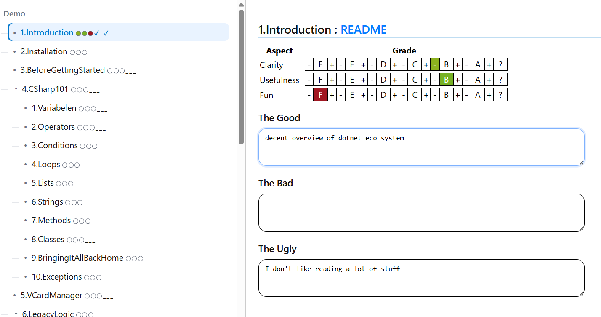

# sedarg 
> <=> grades
*A tiny Lamdera app for course evaluations, where the learners grade the coach 

Elm frontend + Elm backend (Lamdera). JSON import/export for backups and analysis. 


## Features

* **Master–detail UI** for selecting an exercise and editing an evaluation
* **Grade matrix** (A+…F) for *Clarity*, *Usefulness*, *Fun*
* **Good / Bad / Ugly** free‑text reflections
* **Autosave** (on edit) to the Lamdera backend
* **JSON import/export** for backups & offline analysis

## Screenshot



## Quickstart

### Prereqs

* [Elm](https://elm-lang.org/) (0.19.1)
* [Lamdera CLI](https://lamdera.com)

### Run locally

```bash
lamdera live
```

Visit [http://localhost:8000](http://localhost:8000)

### Deploy

```bash
lamdera deploy
```

> Tip: after first data collection, export JSON as a baseline before refactors/migrations.

## Project structure (high‑level)

```
src/
  Backend.elm       -- pure state + ToBackend/ToFrontend protocol
  Env.elm           -- per-environment configuration.
  ExerciseList.elm  -- static tree of exercises + id => exercise index
  Frontend.elm      -- model, update, view wiring (views are in UI...)
  Grade.elm         -- the Grade type and helper functions
  Serialize.elm     -- JSON encoders/decoders for Users/Evaluations
  Types.elm         -- shared types & messages
  UI<...>.elm       -- views (master/detail, grade matrix, text areas)
  Users.elm         -- initial user list (internal use)
```

##  Protocol (frontend <=> backend)

### ToBackend

* `LoggedOn String`: authenticate by passphrase
* `SaveEvaluation String Int Evaluation`: *(name, exerciseId, evaluation)*
* `GetJsonString`: request export
* `UploadData String`: import JSON

### ToFrontend

* `GotUser (Maybe User)`: login result
* `Download String`: JSON export payload


## Roadmap
* Session‑based auth and user index on backend
* Idempotent saves + debounce autosave on frontend
* Merge‑import (by user name) 

## Reuse 

For a new course:

1. Update `ExerciseList.elm` with the new tree (ids, numbers, titles)
2. Seed `Users.elm` (or import from JSON)
3. Deploy a fresh Lamdera app instance

## License

MIT: see `LICENSE`.

